<p align="center">
  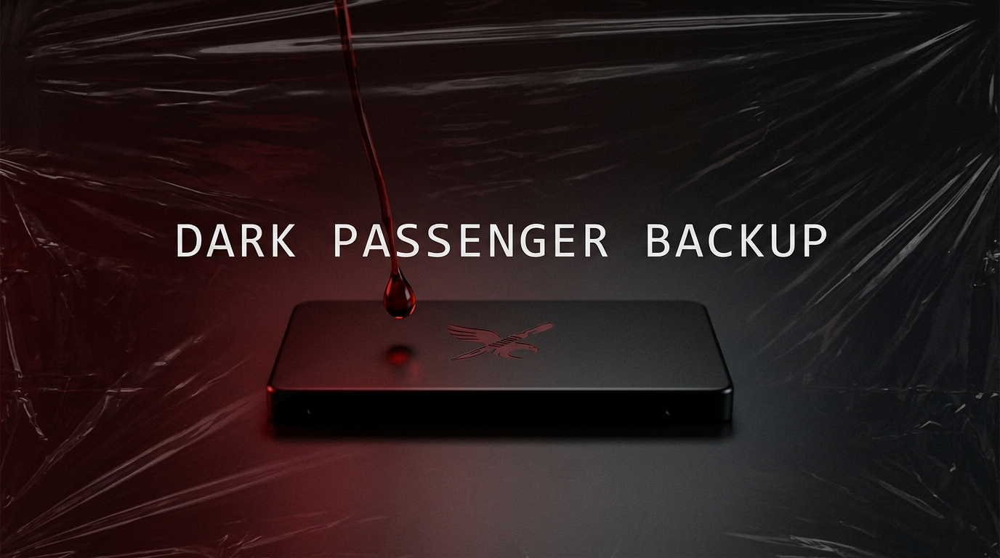
</p>

<h1 align="center">🔪 Dark Passenger Backup</h1>

<p align="center">
  <em>Silencioso. Automático. Siempre ahí.</em>
</p>

<p align="center">
  
  
  
  
</p>

<p align="center">
  
  
</p>

---

## 🩸 ¿Qué es Dark Passenger Backup?

**Dark Passenger Backup** es una aplicación de escritorio para Windows que protege tus archivos haciendo copias de seguridad automáticas a tu disco duro externo (SSD/HDD USB).

La app vive en las sombras de tu ordenador: silenciosa, invisible, siempre vigilante. Cuando conectas tu SSD externo, **despierta y te pregunta si quieres hacer la copia de seguridad**. Si olvidas hacerla, te manda un recordatorio.

No necesitas pensar en ello. Solo conecta el disco y ella se encarga del resto.

---

## 🖥️ La Interfaz de Usuario

La interfaz está dividida en varias secciones accesibles desde la barra lateral izquierda. Aquí te explicamos qué ves en cada una:

### ◉ Dashboard

<p align="center">
  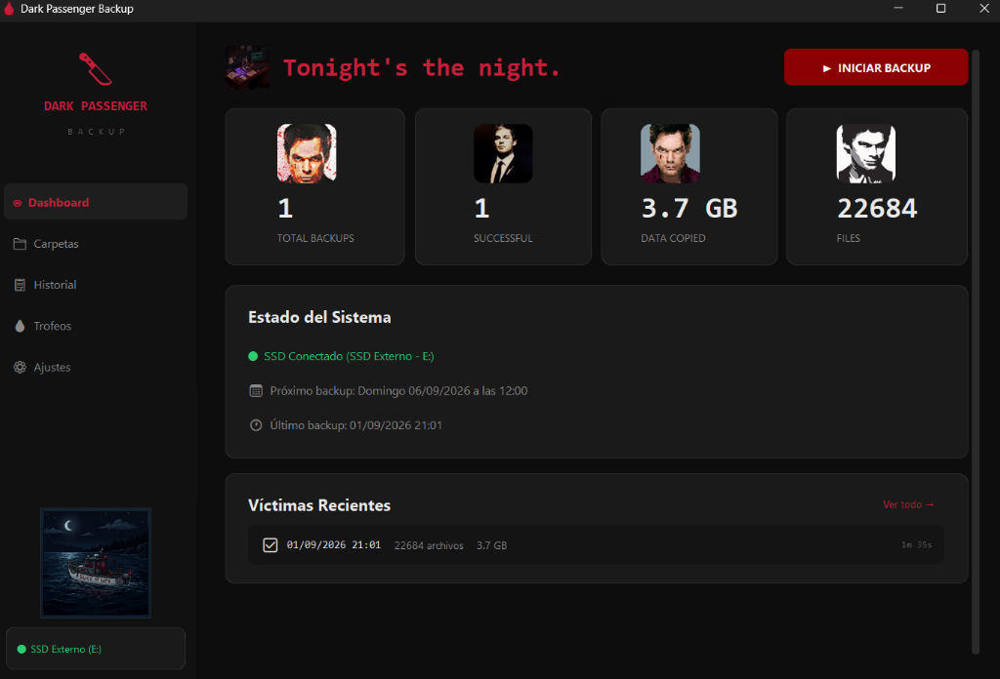
</p>

Es la pantalla principal que ves al abrir la app. De un vistazo tienes toda la información importante:

- **Arriba a la derecha** hay un botón grande rojo **"INICIAR BACKUP"** para lanzar la copia manualmente cuando quieras, sin esperar a que la app te lo pida.
- **Las 4 tarjetas** muestran el total de backups realizados, cuántos salieron bien, cuántos datos has copiado en total y cuántos archivos.
- **Estado del Sistema** te dice si el SSD está conectado ahora mismo, cuándo está programado el próximo backup y cuándo fue el último que se hizo.
- **Víctimas Recientes** es el registro de los últimos backups, con fecha, archivos copiados y si salió todo bien. Cuando hay un backup en curso, aparece aquí mismo la barra de **Progreso del Ritual** con el nombre del archivo que se está copiando, cuántos archivos van y el porcentaje completado.

### 🔪 El Ritual (Popup Inteligente)

<p align="center">
  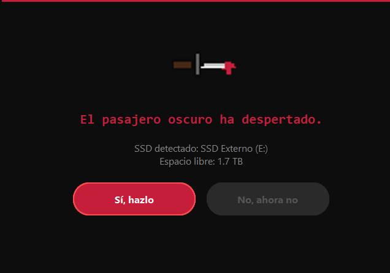
</p>

Cuando conectas tu disco externo, la aplicación detecta la conexión automáticamente y muestra esta ventana emergente. Te dice qué disco ha detectado y cuánto espacio libre tiene. Tienes dos opciones:

- **"Sí, hazlo"** — empieza el backup ahora mismo.
- **"No, ahora no"** — lo pospone. La app recordará que tienes un backup pendiente.

### 📁 Carpetas

<p align="center">
  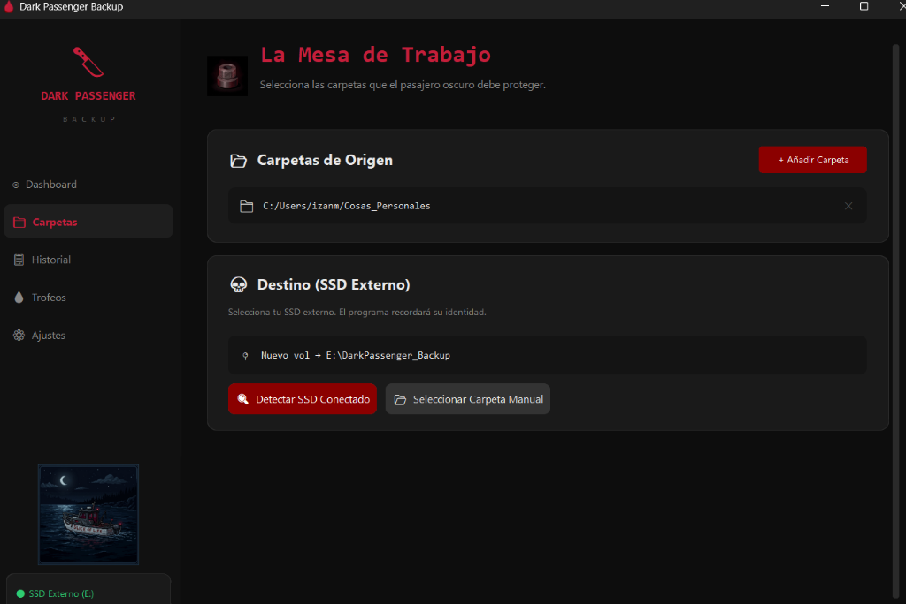
</p>

Aquí defines **qué carpetas quieres proteger** y **cuál es tu disco de destino**. Puedes añadir y quitar carpetas con un clic. También es donde registras tu SSD para que la app lo reconozca automáticamente cada vez que lo conectes.

### 📋 Historial

<p align="center">
  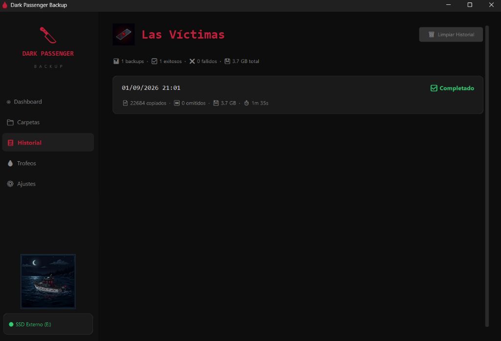
</p>

Un registro completo de todos los backups: fecha y hora, cuántos archivos se copiaron, tamaño total, cuánto tardó y si hubo algún error. Si cancelas un backup a mitad, no aparece aquí — solo se guardan los que terminaron.

### 🏆 Trofeos

<p align="center">
  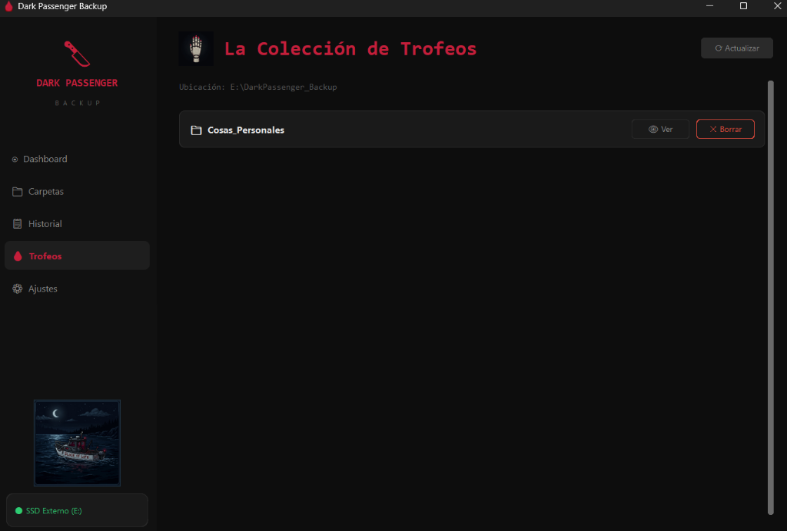
</p>

Muestra los archivos y carpetas que ya están guardados en tu SSD. Puedes explorar lo que hay copiado y eliminar lo que ya no necesites conservar.

### ⚙️ Ajustes

<p align="center">
  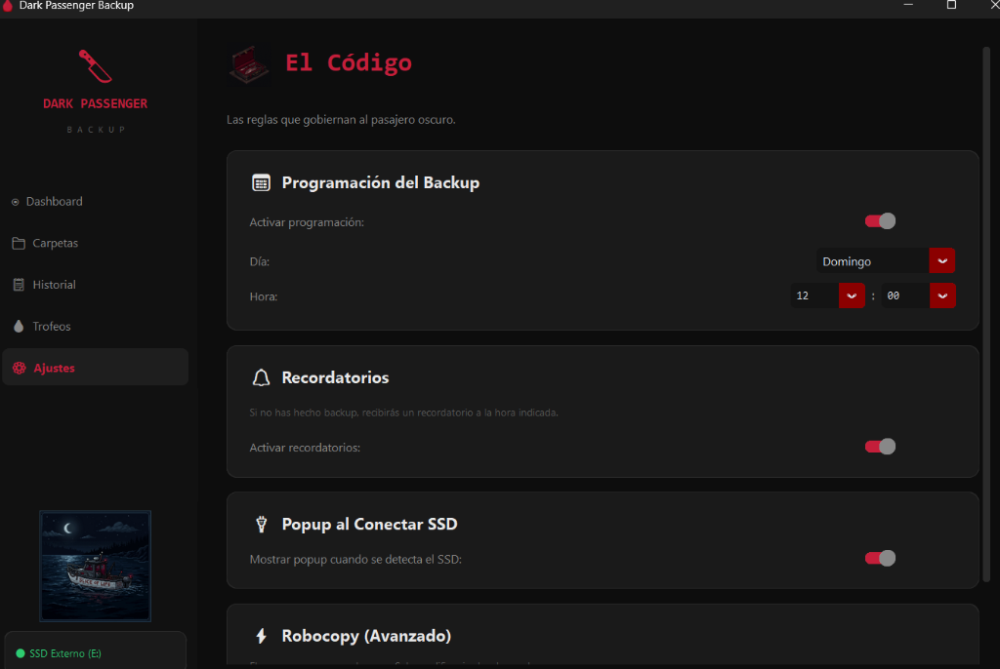
</p>

Desde aquí configuras cuándo quieres que la app te recuerde hacer el backup (día de la semana y hora), si quieres recibir notificaciones cuando lo olvidas, y si quieres que el popup aparezca automáticamente al conectar el disco.

---

## 🚀 Ejemplo real: copiando mi carpeta Cosas_Personales

Así se ve el proceso completo paso a paso, desde que abro la app hasta que termina el backup.

### Paso 1 — Abro la app y pulso "INICIAR BACKUP"

<p align="center">
  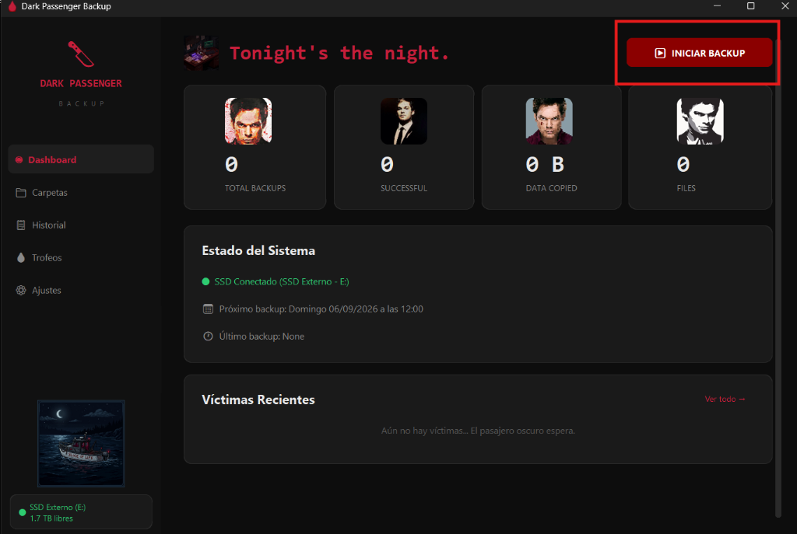
</p>

Tengo el SSD ya conectado (se ve abajo a la izquierda: *SSD Externo (E:) — 1.7 TB libres*). Pulso el botón rojo **"INICIAR BACKUP"** en la esquina superior derecha para arrancar la copia manualmente.

---

### Paso 2 — El backup arranca y puedo ver el progreso en tiempo real

<p align="center">
  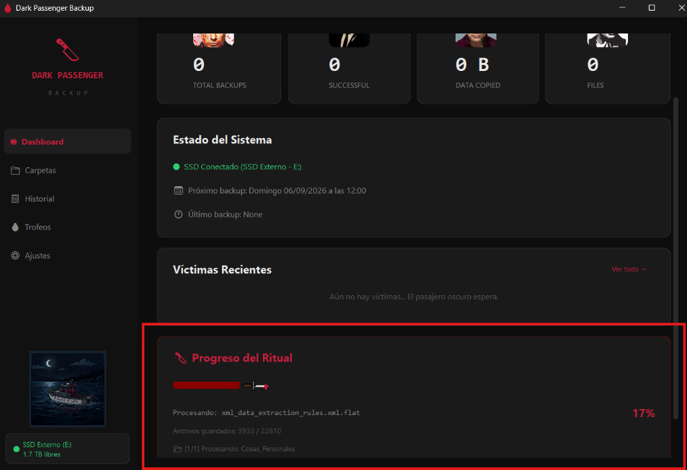
</p>

Aparece el bloque **"Progreso del Ritual"** en la parte de abajo del dashboard. La barra roja avanza a medida que se van copiando los archivos. Puedo ver:

- El **nombre del archivo** que se está procesando en este momento.
- **Cuántos archivos van** del total (en este caso 3.933 de 22.810).
- La **carpeta** que se está copiando: `[1/1] Procesando: Cosas_Personales`.
- El **porcentaje** completado a la derecha (17%).

Todo en tiempo real, sin tener que hacer nada más.

---

### Paso 3 — El backup termina y aparece el resumen

<p align="center">
  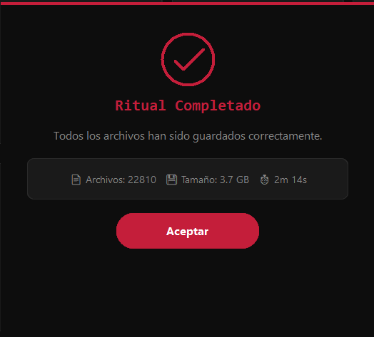
</p>

Cuando termina, aparece esta ventana con el resumen completo:

- **22.810 archivos** copiados correctamente.
- **3,7 GB** de datos guardados.
- Ha tardado **2 minutos y 14 segundos**.

Pulso **"Aceptar"** y listo.

---

### Paso 4 — Los archivos aparecen en la sección Trofeos

<p align="center">
  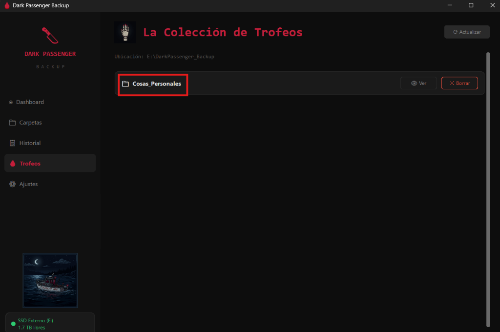
</p>

En la sección **Trofeos** ya aparece la carpeta `Cosas_Personales` guardada en el SSD (`E:\DarkPassenger_Backup`). Desde aquí puedo verla o borrarla si ya no la necesito.

---

## ⚙️ ¿Cómo funciona por dentro?

```
              ┌──────────────┐
              │  Enciendes   │
              │    el PC     │
              └──────┬───────┘
                     │
                     ▼
         ┌───────────────────────┐
         │  Dark Passenger se    │
         │  inicia en silencio   │
         │  (bandeja del sistema)│
         └───────────┬───────────┘
                     │
          ┌──────────┴──────────┐
          │                     │
          ▼                     ▼
   ┌──────────────┐    ┌───────────────┐
   │  SSD Watcher │    │   Scheduler   │
   │  (cada 3s    │    │  (comprueba   │
   │  comprueba   │    │   la hora     │
   │  si el SSD   │    │  programada)  │
   │  está puesto)│    └───────┬───────┘
   └──────┬───────┘            │
          │                    │
          ▼                    ▼
   ┌──────────────┐    ┌───────────────┐
   │  ¿SSD        │    │ ¿Es la hora   │
   │  conectado?  │    │  del backup?  │
   └──────┬───────┘    └───────┬───────┘
     Sí   │                    │  Sí
          ▼                    ▼
   ┌──────────────┐    ┌───────────────┐
   │  POPUP:      │    │ ¿Backup       │
   │  ¿Hacemos    │    │  pendiente?   │
   │  backup?     │    │  → AVISO 🔔   │
   └──────┬───────┘    └───────────────┘
     Sí   │
          ├─────────────────────────────────┐
          │                                 │
          │   (O manualmente: abres la app  │
          │    y pulsas "INICIAR BACKUP"    │
          │    si el SSD ya está conectado) │
          │                                 │
          ▼                                 │
   ┌──────────────┐◄────────────────────────┘
   │  ROBOCOPY    │
   │  Copia solo  │
   │  lo nuevo/   │
   │  modificado  │
   └──────┬───────┘
          │
          ▼
   ┌──────────────┐
   │  ✅ Hecho.   │
   │  Historial   │
   │  actualizado │
   └──────────────┘
```

---

## 📂 Estructura del Proyecto

```
Dark-Passenger-Backup/
│
├── 🔪 main.py                 # Punto de entrada de la aplicación
├── 🩸 instalar.bat             # Instalador automático (doble clic)
├── 📋 requirements.txt         # Dependencias de Python
├── 🎨 app.ico                  # Icono de la aplicación (gota de sangre)
├── 🖼️ create_icon.py           # Generador del icono
├── 📖 README.md                # Este archivo
├── 🚫 .gitignore
│
├── src/                        # Código fuente
│   ├── app.py                  # 🎨 Interfaz gráfica (CustomTkinter)
│   ├── config_manager.py       # ⚙ Gestión de configuración (JSON)
│   ├── history_manager.py      # 📋 Historial de backups
│   ├── ssd_detector.py         # 🔌 Detección de SSD en tiempo real
│   ├── backup_engine.py        # 🔧 Motor de copia (Robocopy)
│   └── scheduler.py            # ⏰ Programación y recordatorios
│
└── docs/
    └── img/                    # Imágenes para documentación
```

---

## 🛠️ Tecnologías Utilizadas

| Tecnología | Para qué se usa | ¿Por qué? |
|:---:|:---|:---|
| **Python 3** | Lenguaje principal | Fácil de leer, enorme comunidad, ideal para automatización |
| **CustomTkinter** | Interfaz gráfica | Moderno, modo oscuro nativo, sin necesidad de navegador |
| **Robocopy** | Motor de copia de archivos | Nativo de Windows, ultrarrápido, solo copia lo modificado |
| **JSON** | Configuración e historial | Ligero, legible, sin bases de datos |
| **ctypes** | Detección de hardware | Acceso directo a la API de Windows sin dependencias extra |
| **pystray** | Icono en bandeja del sistema | Permite que la app viva de fondo sin molestar |

---

## 🚀 Instalación paso a paso

### Requisitos previos

Antes de empezar, solo necesitas tener **Python 3.10 o superior** instalado en tu Windows.

> 💡 **¿No tienes Python?** Descárgalo gratis desde [python.org](https://www.python.org/downloads/). 
> Durante la instalación, **marca la casilla "Add Python to PATH"**. Es importante.

### Paso 1 — Descarga el proyecto

Tienes dos opciones:

**Opción A: Con Git (recomendado)**
```bash
git clone https://github.com/TU_USUARIO/Dark-Passenger-Backup.git
cd Dark-Passenger-Backup
```

**Opción B: Descarga directa**
1. Haz clic en el botón verde **"Code"** → **"Download ZIP"**
2. Descomprime el ZIP donde quieras

### Paso 2 — Ejecuta el instalador

Busca el archivo `instalar.bat` dentro de la carpeta del proyecto y **haz doble clic** sobre él.

```
📁 Dark-Passenger-Backup/
   └── 🩸 instalar.bat   ← Doble clic aquí
```

El instalador hará todo solo:

| Paso | Qué hace | Tiempo |
|:---:|:---|:---:|
| 1️⃣ | Comprueba que tienes Python instalado | 1 segundo |
| 2️⃣ | Instala las dependencias automáticamente | ~15 segundos |
| 3️⃣ | Crea un acceso directo en tu Escritorio | 1 segundo |
| 4️⃣ | Configura el inicio automático en segundo plano | 1 segundo |

Cuando termine, verás esto en la terminal:

```
 ─────────────────────────────────────────────────────────────
  Instalacion completada.

  En tu Escritorio: "Dark Passenger Backup" (abre la app)
  Inicio automatico: activo (vigila tu SSD en segundo plano)

  Conecta tu SSD en cualquier momento y la app se abrira
  automaticamente preguntandote si quieres hacer backup.
 ─────────────────────────────────────────────────────────────
```

### Paso 3 — Abre la aplicación (O conecta tu SSD)

Puedes buscar **"Dark Passenger Backup"** en tu Escritorio (tendrá un icono de gota de sangre 🩸) y hacer **doble clic** para abrirla y configurarla.

O simplemente, **conecta tu SSD configurado**. El vigilante que corre en segundo plano detectará el disco y **abrirá la aplicación automáticamente** mostrándote el popup de backup.

---

## 🔧 Configuración inicial (Primera vez)

Una vez abierta la app, necesitas hacer dos cosas: **decirle qué carpetas copiar** y **decirle cuál es tu SSD**.

### 1. Selecciona tus carpetas 📂

1. En la barra lateral izquierda, haz clic en **"📁 Carpetas"**
2. Pulsa **"+ Añadir Carpeta"**
3. Selecciona cualquier carpeta que quieras proteger:
   - Tus documentos
   - Tus fotos
   - Tus proyectos
   - Lo que tú quieras

Puedes añadir **tantas carpetas como necesites**. Para eliminar una, pulsa la ✕ que aparece a su derecha.

### 2. Registra tu SSD externo 💾

Este paso le dice a la app **cuál es tu disco externo** para que lo reconozca automáticamente cada vez que lo conectes.

1. **Conecta tu SSD/disco externo** al ordenador por USB
2. En la sección **"💀 Destino"**, pulsa **"🔍 Detectar SSD Conectado"**
3. Aparecerá una ventana con todos los discos detectados
4. Haz clic en **"Seleccionar"** en el que sea tu SSD

> 💡 La app identifica tu SSD por su **número de serie de volumen** (un código único e invisible). Esto significa que puede reconocer tu disco concreto aunque cambies el puerto USB o la letra de unidad.

### 3. Ajusta el horario ⏰ (opcional)

1. Ve a **"⚙ Ajustes"**
2. Elige el **día** (por defecto: Domingo) y la **hora** (por defecto: 12:00)
3. Activa o desactiva los **recordatorios**

¡Listo! Ya no tienes que hacer nada más. A partir de ahora:

```
┌─────────────────────────────────────────────────────┐
│                                                     │
│   Conectas el SSD  →  Popup pregunta  →  Backup ✅  │
│                                                     │
│   Olvidaste el backup  →  Recordatorio  →  🔔       │
│                                                     │
└─────────────────────────────────────────────────────┘
```

---

## 🧠 ¿Qué pasa si...?

| Escenario | Qué hace la app |
|:---|:---|
| Conecto mi SSD un lunes cualquiera | Te salta el **popup** preguntando si quieres hacer backup |
| Es domingo a las 12:00 y no he hecho backup | Te manda un **recordatorio** (notificación) |
| El PC estaba apagado el domingo | No pasa nada. La próxima vez que conectes el SSD, el popup te avisará |
| No conecto mi SSD en toda la semana | La app recuerda que el backup está pendiente y te lo indica en el dashboard |
| Cancelo el backup a mitad | El sistema actúa como si nada hubiera pasado. No se guarda registro, no hay rastros. |
| Mi SSD se desconecta durante el backup | Robocopy es tolerante a errores, reintenta automáticamente. Si no puede, lo marca como error |
| Quiero copiar una carpeta nueva | Ve a "Carpetas" y añádela. Se incluirá en el próximo backup |

---

## 📦 Dependencias

```
customtkinter    → Interfaz gráfica moderna
pystray          → Icono en la bandeja del sistema
Pillow           → Procesamiento de imágenes (icono)
pywin32          → Acceso a APIs de Windows
```

Se instalan automáticamente con `instalar.bat` o manualmente con:

```bash
pip install -r requirements.txt
```

---

## 🤝 Contribuir

¿Quieres mejorar Dark Passenger? ¡Bienvenido al ritual!

1. Haz **Fork** del repositorio
2. Crea una rama para tu feature: `git checkout -b mi-feature`
3. Haz commit: `git commit -m "Añadir mi feature"`
4. Push: `git push origin mi-feature`
5. Abre un **Pull Request**

---

## 📜 Licencia

Este proyecto está bajo la licencia **MIT**. Úsalo, modifícalo, compártelo.

---

<p align="center">
  <br>
  
  <br><br>
  <strong>Dark Passenger Backup</strong> — Tus archivos están a salvo. El pasajero oscuro los protege.
</p>
